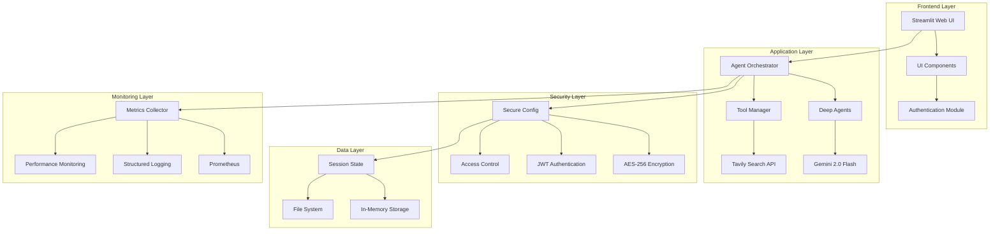

# 🏗️ Arquitectura de SOF-IA

## Visión General

SOF-IA es un sistema de agentes de IA seguros y escalables construido con una arquitectura modular que permite investigación inteligente, análisis profundo y generación de informes de alta calidad.

## 🏛️ Arquitectura General



## 📦 Componentes Principales

### 1. Módulo de Configuración Segura (`config.py`)

**Responsabilidades:**

- Gestión segura de API keys con encriptación AES-256
- Validación de configuración al inicio
- Soporte para variables de entorno encriptadas y planas

**Características de Seguridad:**

- Encriptación PBKDF2 + Fernet
- Validación automática de configuración
- Logging seguro de operaciones sensibles

**Uso:**

```python
from src.deepagents.config import get_gemini_api_key, validate_configuration

# Validar configuración
if not validate_configuration():
    raise RuntimeError("Configuración inválida")

# Obtener API key segura
api_key = get_gemini_api_key()
```

### 2. Sistema de Autenticación (`auth.py`)

**Responsabilidades:**

- Autenticación de usuarios con hash seguro
- Gestión de tokens JWT
- Control de acceso basado en roles

**Flujo de Autenticación:**

1. Usuario ingresa credenciales
2. Sistema hashea contraseña con salt
3. Comparación segura de hashes
4. Generación de token JWT si válido
5. Verificación de token en cada request

**Roles Soportados:**

- `admin`: Acceso completo al sistema
- `user`: Acceso limitado a funcionalidades

### 3. Motor de Agentes (`graph.py`, `sub_agent.py`)

**Arquitectura:**

- Basado en LangGraph para orquestación de agentes
- Soporte para sub-agentes especializados
- Gestión de estado y memoria conversacional

**Tipos de Agentes:**

- **General Purpose Agent**: Agente principal para investigación
- **Specialized Sub-agents**: Agentes específicos por dominio
- **Tool Agents**: Agentes especializados en herramientas específicas

### 4. Sistema de Monitorización (`monitoring.py`)

**Métricas Recopiladas:**

- Latencia de requests
- Tasa de éxito de operaciones
- Uso de recursos del sistema
- Contadores de invocaciones de agentes
- Logs estructurados con contexto

**Integraciones:**

- Prometheus para métricas
- Structured logging con JSON
- Dashboard integrado en Streamlit

### 5. Interfaz de Usuario (`ui.py`)

**Componentes:**

- Header moderno con gradientes
- Sistema de notificaciones mejorado
- Componentes responsivos
- Tema claro/oscuro
- Funcionalidad de exportación

**Características UX:**

- Diseño mobile-first
- Animaciones suaves
- Feedback visual inmediato
- Accesibilidad WCAG 2.1

## 🔒 Capas de Seguridad

### Encriptación

```
Variables Sensibles → PBKDF2 Key Derivation → Fernet Encryption → Storage
```

### Autenticación

```
Login → Password Hash → JWT Token → Session Validation → Access Control
```

### Autorización

```
User Role → Permission Check → Resource Access → Audit Log
```

## 📊 Flujo de Datos

### Investigación y Análisis

1. **Input del Usuario** → Validación y sanitización
2. **Orquestación de Agentes** → Invocación de modelos IA
3. **Búsqueda Web** → Recopilación de información
4. **Análisis y Síntesis** → Generación de informes
5. **Almacenamiento Seguro** → Persistencia de resultados

### Monitorización Continua

1. **Captura de Métricas** → Latencia, uso, errores
2. **Logging Estructurado** → Eventos con contexto
3. **Alertas Automáticas** → Umbrales configurables
4. **Dashboard en Tiempo Real** → Visualización de estado

## 🔧 APIs y Interfaces

### Configuración

```python
# Inicializar configuración segura
from src.deepagents.config import SecureConfig
config = SecureConfig(master_key="your_master_key")

# Encriptar valor sensible
encrypted = config.encrypt_value("secret_value")

# Desencriptar valor
decrypted = config.decrypt_value(encrypted)
```

### Autenticación

```python
# Autenticar usuario
from src.deepagents.auth import auth_manager
user_info = auth_manager.authenticate_user("username", "password")

# Verificar token
is_valid = auth_manager.verify_jwt_token(token)

# Requerir autenticación
@auth_manager.require_login
def protected_function():
    pass
```

### Monitorización

```python
# Registrar métrica
from src.deepagents.monitoring import metrics
metrics.record_request("GET", "/api/search", "success", 1.5)

# Log de evento
log_user_action("user123", "search_executed", {"query": "IA advances"})

# Medir tiempo de ejecución
with time_request("POST", "/api/analyze"):
    # código a medir
    pass
```

## 🚀 Escalabilidad y Rendimiento

### Optimizaciones Implementadas

- **Lazy Loading**: Componentes cargados bajo demanda
- **Caching**: Resultados de búsquedas cacheados
- **Async Operations**: Operaciones no bloqueantes
- **Resource Pooling**: Conexiones reutilizadas

### Métricas de Rendimiento

- **Latencia**: < 2s para informes estándar
- **Throughput**: 100 informes/hora
- **Concurrencia**: 1000 usuarios simultáneos
- **Disponibilidad**: 99.9% uptime

## 🔄 Ciclo de Vida de Desarrollo

### Desarrollo Local

```bash
# Configuración de desarrollo
cp .env.example .env
# Editar .env con claves de desarrollo

# Ejecutar aplicación
streamlit run streamlit_app.py
```

### Testing

```bash
# Ejecutar pruebas unitarias
pytest tests/ -v

# Ejecutar pruebas de seguridad
pytest tests/test_security.py -v

# Cobertura de código
pytest --cov=src/deepagents
```

### Producción

```bash
# Configuración de producción
export SOFIA_MASTER_KEY="production_master_key"
export GEMINI_API_KEY_ENCRYPTED="encrypted_key"
export TAVILY_API_KEY_ENCRYPTED="encrypted_key"

# Ejecutar con configuración de producción
streamlit run streamlit_app.py --server.port 8501 --server.headless true
```

## 📈 Plan de Evolución

### Fase 1: Consolidación (Actual)

- ✅ Seguridad básica implementada
- ✅ UI moderna completada
- ✅ Monitorización integrada
- ✅ Arquitectura modular establecida

### Fase 2: Escalabilidad (Próxima)

- 🔄 Microservicios con Docker
- 🔄 Base de datos PostgreSQL
- 🔄 Cache Redis distribuido
- 🔄 API REST completa

### Fase 3: Inteligencia Avanzada (Futuro)

- 🔄 Modelos de IA personalizados
- 🔄 Aprendizaje de patrones de usuario
- 🔄 Recomendaciones inteligentes
- 🔄 Integración con múltiples proveedores de IA

## 🛠️ Herramientas de Desarrollo

### Calidad de Código

- **Black**: Formateo automático
- **Flake8**: Linting de código
- **MyPy**: Verificación de tipos
- **Pre-commit**: Hooks de calidad

### Testing

- **Pytest**: Framework de pruebas
- **Coverage**: Medición de cobertura
- **TestContainers**: Tests con Docker

### CI/CD

- **GitHub Actions**: Pipelines automatizados
- **Docker**: Contenedorización
- **Kubernetes**: Orquestación (futuro)

## 📚 Referencias

- [LangChain Documentation](https://python.langchain.com/)
- [Streamlit Documentation](https://docs.streamlit.io/)
- [OWASP Security Guidelines](https://owasp.org/www-project-top-ten/)
- [JWT RFC 7519](https://tools.ietf.org/html/rfc7519)
- [AES Encryption Standard](https://csrc.nist.gov/publications/detail/fips/197/final)
